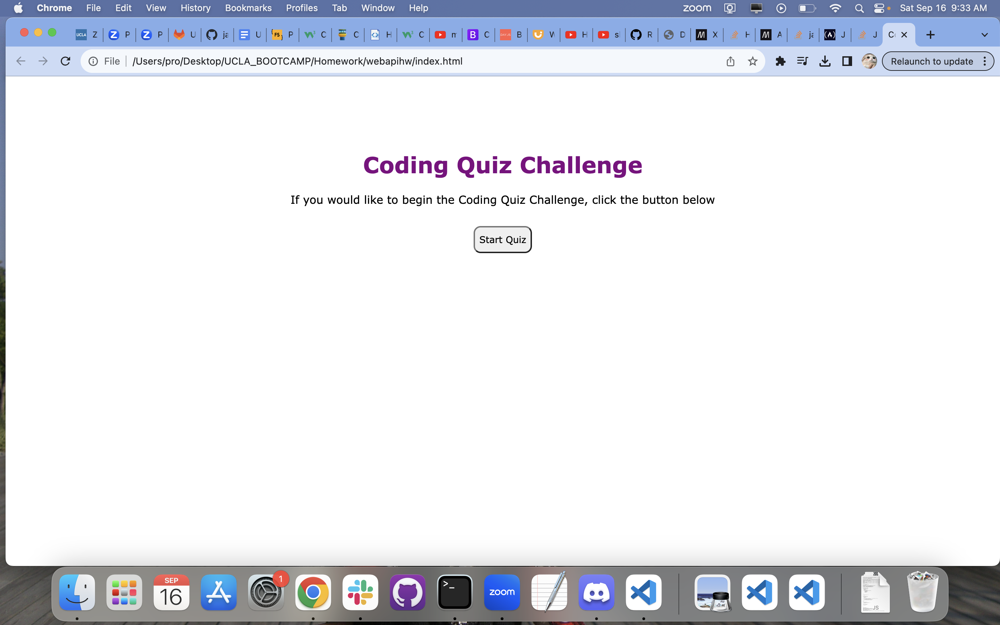

# API_Code_Quiz

## Installation

N/A Webpage is viewable online

## Usage
This is the webpage displayed at full screen,
    ```md
    

Selecting the Start Quiz button will populate the quiz in the browser, with 4 option buttons presented in blue. A timer countdown starts from 75 seconds.  
    ```md
    

Hovering over the button will outline it in gold. If the wrong answer is selected from the presented options, an alert displaying "wrong!" will pop up and an additonal 6 seconds is removed from the timer. 
    ```md
    

However, if the correct answer is selected from the presented options, an alert displaying "correct!" will pop up. 
    ```md
    

Additionally, selecting the correct answer will populate the next question in the browser with a new set of answer options. 
    ```md
    

Once you are finished playing either via getting all the correct answers or the timer expiring, the quiz will thank you for playing and display your final score out of the total number of questions. The input will prompt user to submit their initials to be saved for the leaderboard. 
    ```md
    

If try to proceed without submitting your initials or submitting no initials results in an alert pop up asking you to do so. 
    ```md
    

Once you submit your inititals an alert that your score is being added to the leaderboard will display
    ```md
    

The Leaderboard will populate with your new high score! and have a play quiz again function where you or a second player can start the quiz.
    ```md
    

Having a second player play the game and submit their scores to the leader board... 
    ```md
    

The Leaderboard will populate with mulitple players new high score! 
    ```md
    

The Leaderboard will also rank players from most questions answered correctly in first place to least amount of questions answered correctly  in last place. 
    ```md
    

The console is also used various times see Player names, the arrays of overall scores, and the instances of the quiz being played. Also it is mobile compatible! 
    ```md
    


## License

[MIT](https://choosealicense.com/licenses/mit/)

    ```

## Credit
Readme.md Guide(https://coding-boot-camp.github.io/full-stack/github/professional-readme-guide)
CSS Tutorials (https://www.w3schools.com/)
Tutor: Wen-jui Cheng!


## How to Contribute

If you created an application or package and would like other developers to contribute it, you can include guidelines for how to do so. The [Contributor Covenant](https://www.contributor-covenant.org/) is an industry standard, but you can always write your own if you'd prefer.

